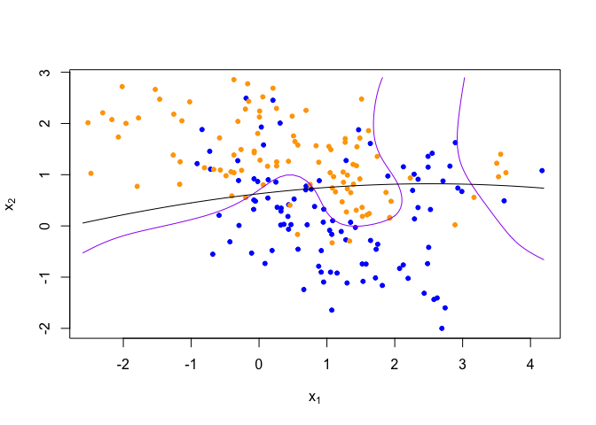

Homework 1
================
Donald Kane
January 27, 2022

``` r
library('class')
library('dplyr')
```

## load binary classification example data from author website

## ‘ElemStatLearn’ package no longer available

``` r
load(url('https://web.stanford.edu/~hastie/ElemStatLearn/datasets/ESL.mixture.rda'))
dat <- ESL.mixture
```

``` r
plot_mix_data <- expression({
  plot(dat$x[,1], dat$x[,2],
       col=ifelse(dat$y==0, 'blue', 'orange'),
       pch=20,
       xlab=expression(x[1]),
       ylab=expression(x[2]))
  ## draw Bayes (True) classification boundary
  prob <- matrix(dat$prob, length(dat$px1), length(dat$px2))
  cont <- contourLines(dat$px1, dat$px2, prob, levels=0.5)
  rslt <- sapply(cont, lines, col='purple')
})

eval(plot_mix_data)
```

<!-- -->

## Re-write the functions fit\_lc and predict\_lc using lm, and the associated predict method for lm objects.

## Consider making the linear classifier more flexible, by adding squared terms for x1 and x2 to the linear model

``` r
## fit linear classifier
fit_lm <- function(y,x){
  data <- data.frame(y = y, x1 = x[,1], x2 = x[,2])
  m1 <- lm(y ~ poly(x1, 2) + poly(x2, 2), data = data)
  return(m1)
}

## make predictions from linear classifier
predict_lm <- function(x, m1) {
  xdata <- data.frame(x1 = x[,1], x2 = x[,2])
  predict(m1, xdata)
}

## fit model to mixture data and make predictions
lm_beta <- fit_lm(dat$y, dat$x)
lm_pred <- predict(lm_beta, newdata = data.frame(dat$xnew))


## reshape predictions as a matrix
lm_pred <- matrix(lm_pred, length(dat$px1), length(dat$px2))

contour(lm_pred,
      xlab=expression(x[1]),
      ylab=expression(x[2]))
```

<!-- -->

``` r
## find the contours in 2D space such that lc_pred == 0.5
lm_cont <- contourLines(dat$px1, dat$px2, lm_pred, levels=0.5)

## plot data and decision surface
eval(plot_mix_data)
sapply(lm_cont, lines)
```

<!-- -->

    ## [[1]]
    ## NULL

## Describe how this more flexible model affects the bias-variance tradeoff

This more flexible model affects the bias-variance tradeoff by allowing
the model to capture a more complex underlying process. An infelxible
model does not have this ability which leads to higher bias in the
model. Using the squared terms added more bias, but reduced the overall
variance of the model. As the model complexity increases, the variance
increases while the bias decreases. The goal of using this bias-variance
tradeoff is to minimize the test error of the model. The bias error
comes from bad assumptions from the learning of the algorithm, while the
variance term describes the sensitivity of the fluctuations in the
training data.
