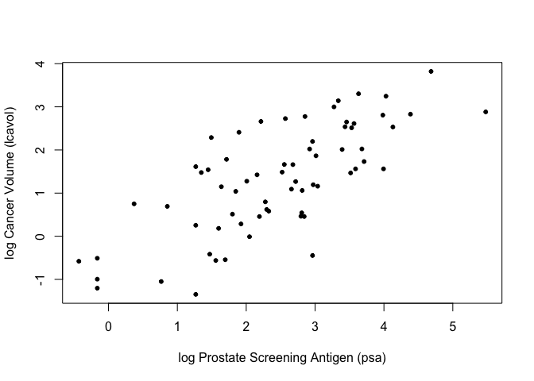
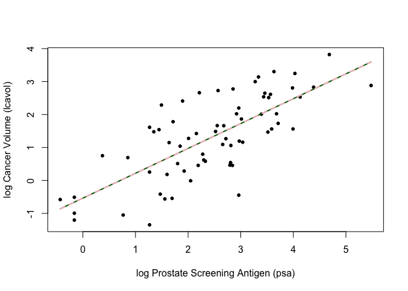
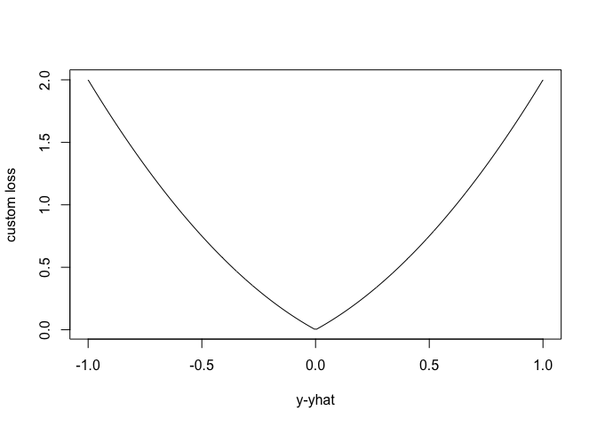
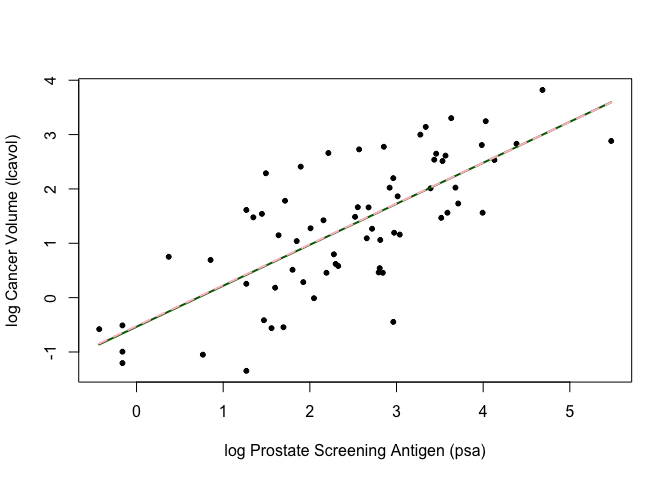
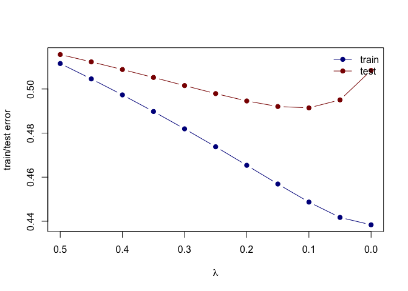
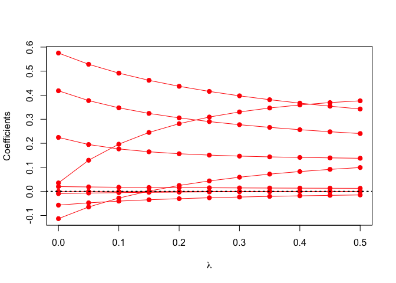

Homework 3
================
Donald Kane
February 15, 2022

``` r
library(glmnet)
library(dplyr)
## load prostate data
prostate <- 
  read.table(url(
    'https://web.stanford.edu/~hastie/ElemStatLearn/datasets/prostate.data'))
```

``` r
## subset to training examples
prostate_train <- subset(prostate, train==TRUE)

## plot lcavol vs lpsa
plot_psa_data <- function(dat=prostate_train) {
  plot(dat$lpsa, dat$lcavol,
       xlab="log Prostate Screening Antigen (psa)",
       ylab="log Cancer Volume (lcavol)",
       pch = 20)
}
plot_psa_data()
```

<!-- -->

``` r
############################
## regular linear regression
############################

## L2 loss function
L2_loss <- function(y, yhat)
  (y-yhat)^2

## fit simple linear model using numerical optimization
fit_lin <- function(y, x, loss=L2_loss, beta_init = c(-0.51, 0.75)) {
  err <- function(beta)
    mean(loss(y,  beta[1] + beta[2]*x))
  beta <- optim(par = beta_init, fn = err)
  return(beta)
}

## make predictions from linear model
predict_lin <- function(x, beta)
  beta[1] + beta[2]*x

## fit linear model
lin_beta <- fit_lin(y=prostate_train$lcavol,
                    x=prostate_train$lpsa,
                    loss=L2_loss)

## compute predictions for a grid of inputs
x_grid <- seq(min(prostate_train$lpsa),
              max(prostate_train$lpsa),
              length.out=100)
lin_pred <- predict_lin(x=x_grid, beta=lin_beta$par)

## plot data
plot_psa_data()

## plot predictions
lines(x=x_grid, y=lin_pred, col='darkgreen', lwd=2)

## do the same thing with 'lm'
lin_fit_lm <- lm(lcavol ~ lpsa, data=prostate_train)

## make predictins using 'lm' object
lin_pred_lm <- predict(lin_fit_lm, data.frame(lpsa=x_grid))

## plot predictions from 'lm'
lines(x=x_grid, y=lin_pred_lm, col='pink', lty=2, lwd=2)
```

<!-- -->

``` r
##################################
## try modifying the loss function
##################################

## custom loss function
custom_loss <- function(y, yhat)
  (y-yhat)^2 + abs(y-yhat)

## plot custom loss function
err_grd <- seq(-1,1,length.out=200)
plot(err_grd, custom_loss(err_grd,0), type='l',
     xlab='y-yhat', ylab='custom loss')
```

<!-- -->

``` r
## fit linear model with custom loss
lin_beta_custom <- fit_lin(y=prostate_train$lcavol,
                    x=prostate_train$lpsa,
                    loss=custom_loss)

lin_pred_custom <- predict_lin(x=x_grid, beta=lin_beta_custom$par)

## plot data
plot_psa_data()

## plot predictions from L2 loss
lines(x=x_grid, y=lin_pred, col='darkgreen', lwd=2)

## plot predictions from custom loss
lines(x=x_grid, y=lin_pred_custom, col='pink', lwd=2, lty=2)
```

<!-- -->

# Question 1

### Use the prostate cancer data.

### Use the cor function to reproduce the correlations listed in HTF Table 3.1, page 50.

``` r
res <- cor(as.matrix(prostate))
round(res, 2)
```

    ##         lcavol lweight  age  lbph   svi   lcp gleason pgg45  lpsa train
    ## lcavol    1.00    0.28 0.22  0.03  0.54  0.68    0.43  0.43  0.73 -0.05
    ## lweight   0.28    1.00 0.35  0.44  0.16  0.16    0.06  0.11  0.43 -0.01
    ## age       0.22    0.35 1.00  0.35  0.12  0.13    0.27  0.28  0.17  0.18
    ## lbph      0.03    0.44 0.35  1.00 -0.09 -0.01    0.08  0.08  0.18 -0.03
    ## svi       0.54    0.16 0.12 -0.09  1.00  0.67    0.32  0.46  0.57  0.03
    ## lcp       0.68    0.16 0.13 -0.01  0.67  1.00    0.51  0.63  0.55 -0.04
    ## gleason   0.43    0.06 0.27  0.08  0.32  0.51    1.00  0.75  0.37 -0.04
    ## pgg45     0.43    0.11 0.28  0.08  0.46  0.63    0.75  1.00  0.42  0.10
    ## lpsa      0.73    0.43 0.17  0.18  0.57  0.55    0.37  0.42  1.00 -0.03
    ## train    -0.05   -0.01 0.18 -0.03  0.03 -0.04   -0.04  0.10 -0.03  1.00

# Question 2

### Treat lcavol as the outcome, and use all other variables in the data set as predictors.

### With the training subset of the prostate data, train a least-squares regression model with all predictors using the lm function.

``` r
fit <- lm(lcavol ~ ., data = prostate)
summary(fit)
```

    ## 
    ## Call:
    ## lm(formula = lcavol ~ ., data = prostate)
    ## 
    ## Residuals:
    ##     Min      1Q  Median      3Q     Max 
    ## -1.9087 -0.4700 -0.0436  0.5694  1.8400 
    ## 
    ## Coefficients:
    ##              Estimate Std. Error t value Pr(>|t|)    
    ## (Intercept) -2.372186   1.315776  -1.803   0.0749 .  
    ## lweight     -0.027959   0.213067  -0.131   0.8959    
    ## age          0.022729   0.011362   2.000   0.0486 *  
    ## lbph        -0.094382   0.058541  -1.612   0.1105    
    ## svi         -0.150634   0.255776  -0.589   0.5574    
    ## lcp          0.364920   0.082658   4.415 2.89e-05 ***
    ## gleason      0.189026   0.157891   1.197   0.2345    
    ## pgg45       -0.006859   0.004454  -1.540   0.1272    
    ## lpsa         0.565416   0.088543   6.386 8.08e-09 ***
    ## trainTRUE   -0.044702   0.162846  -0.275   0.7843    
    ## ---
    ## Signif. codes:  0 '***' 0.001 '**' 0.01 '*' 0.05 '.' 0.1 ' ' 1
    ## 
    ## Residual standard error: 0.7041 on 87 degrees of freedom
    ## Multiple R-squared:  0.6766, Adjusted R-squared:  0.6431 
    ## F-statistic: 20.22 on 9 and 87 DF,  p-value: < 2.2e-16

# Question 3

### Use the testing subset to compute the test error (average squared-error loss) using the fitted least-squares regression model

``` r
## subset to training examples
prostate_train <- subset(prostate, train==TRUE)

error <- function(dat, model, loss=L2_loss) {
  mean(loss(dat$lcavol, predict(model, newdata=dat)))
}
error(prostate_train, fit)
```

    ## [1] 0.4520909

# Question 4

### Train a ridge regression model using the glmnet function, and tune the value of lambda (i.e., use guess and check to find the value of lambda that approximately minimizes the test error).

``` r
form  <- lcavol ~  lweight + age + lbph + lcp + pgg45 + lpsa + svi + gleason
x_inp <- model.matrix(form, data=prostate_train)
y_out <- prostate_train$lcavol
fit <- glmnet(x=x_inp, y=y_out, lambda=seq(0.5, 0, -0.05), alpha = 0)
print(fit$beta)
```

    ## 9 x 11 sparse Matrix of class "dgCMatrix"

    ##    [[ suppressing 11 column names 's0', 's1', 's2' ... ]]

    ##                                                                    
    ## (Intercept)  .             .             .             .           
    ## lweight      0.0993164708  9.167566e-02  0.0826683948  0.0719539791
    ## age          0.0129153943  1.324527e-02  0.0136179441  0.0140406458
    ## lbph        -0.0145798645 -1.634009e-02 -0.0183250211 -0.0206075810
    ## lcp          0.2406189663  2.481045e-01  0.2566365965  0.2662889674
    ## pgg45        0.0002559092 -6.282802e-05 -0.0004352183 -0.0008738898
    ## lpsa         0.3427088262  3.542773e-01  0.3670625828  0.3813402190
    ## svi          0.3767521726  3.693591e-01  0.3595330020  0.3468674180
    ## gleason      0.1379543516  1.394770e-01  0.1413173561  0.1436779615
    ##                                                                             
    ## (Intercept)  .            .            .            .            .          
    ## lweight      0.059127616  0.043652593  0.024777969  0.001504802 -0.027603986
    ## age          0.014526957  0.015088490  0.015748487  0.016532948  0.017480107
    ## lbph        -0.023258103 -0.026377963 -0.030098852 -0.034621150 -0.040241264
    ## lcp          0.277447149  0.290342311  0.305728439  0.324372008  0.347616547
    ## pgg45       -0.001398912 -0.002031353 -0.002810371 -0.003788173 -0.005050263
    ## lpsa         0.397429712  0.415786556  0.437009864  0.461951799  0.491849702
    ## svi          0.330415198  0.309283880  0.281608260  0.245177911  0.196427346
    ## gleason      0.146778188  0.150949425  0.156678907  0.164800413  0.176722769
    ##                                      
    ## (Intercept)  .            .          
    ## lweight     -0.064680201 -0.113137304
    ## age          0.018643148  0.020098181
    ## lbph        -0.047425776 -0.056962692
    ## lcp          0.377657417  0.418431830
    ## pgg45       -0.006739814 -0.009116838
    ## lpsa         0.528596455  0.575318051
    ## svi          0.129711598  0.035342349
    ## gleason      0.194999807  0.224585243

``` r
error <- function(dat, fit, lam, form, loss=L2_loss) {
  x_inp <- model.matrix(form, data=dat)
  y_out <- dat$lcavol
  y_hat <- predict(fit, newx=x_inp, s=lam)  ## see predict.elnet
  mean(loss(y_out, y_hat))
}
error(prostate_train, fit, lam = .12, form = form)
```

    ## [1] 0.4516806

# Question 5

### Create a figure that shows the training and test error associated with ridge regression as a function of lambda

``` r
## split prostate into testing and training subsets
prostate_train <- prostate %>%
  filter(train == TRUE) %>% 
  select(-train)

prostate_test <- prostate %>%
  filter(train == FALSE) %>% 
  select(-train)

## compute training and testing errors as function of lambda
err_train_1 <- sapply(fit$lambda, function(lam) 
  error(prostate_train, fit, lam, form))
err_test_1 <- sapply(fit$lambda, function(lam) 
  error(prostate_test, fit, lam, form))

## plot test/train error
plot(x=range(fit$lambda),
     y=range(c(err_train_1, err_test_1)),
     xlim=rev(range(fit$lambda)),
     type='n',
     xlab=expression(lambda),
     ylab='train/test error')
points(fit$lambda, err_train_1, pch=19, type='b', col='darkblue')
points(fit$lambda, err_test_1, pch=19, type='b', col='darkred')
legend('topright', c('train','test'), lty=1, pch=19,
       col=c('darkblue','darkred'), bty='n')
```

<!-- -->

# Question 6

### Create a path diagram of the ridge regression analysis, similar to HTF Figure 3.8

``` r
## plot path diagram
plot(x=range(fit$lambda),
     y=range(as.matrix(fit$beta)),
     type='n',
     xlab=expression(lambda),
     ylab='Coefficients')
for(i in 1:nrow(fit$beta)) {
  points(x=fit$lambda, y=fit$beta[i,], pch=19, col='red')
  lines(x=fit$lambda, y=fit$beta[i,], col='red')
}
abline(h=0, lty=3, lwd=2)
```

<!-- -->
