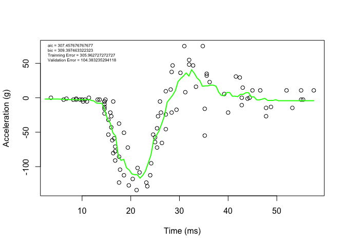

Homework 5
================
Donald Kane
February 22, 2022

``` r
library('MASS') ## for 'mcycle'
library('manipulate') ## for 'manipulate'
```

``` r
y <- mcycle$accel
x <- matrix(mcycle$times, length(mcycle$times), 1)
```

# Question 1

### Randomly split the mcycle data into training (75%) and validation (25%) subsets.

``` r
# create training and testing data
samp = sort(sample(nrow(mcycle), nrow(mcycle)*.75))
train_x <- matrix(x[samp,])
test_x <- matrix(x[-samp,])
train_y <- y[samp]
test_y <- y[-samp]
```

# Question 2

### Using the mcycle data, consider predicting the mean acceleration as a function of time. Use the Nadaraya-Watson method with the k-NN kernel function to create a series of prediction models by varying the tuning parameter over a sequence of values. (hint: the script already implements this)

``` r
kernel_epanechnikov <- function(x, x0, lambda=1) {
  d <- function(t)
    ifelse(t <= 1, 3/4*(1-t^2), 0)
  z <- t(t(x) - x0)
  d(sqrt(rowSums(z*z))/lambda)
}

kernel_k_nearest_neighbors <- function(x, x0, k=1) {
  z <- t(t(x) - x0)
  d <- sqrt(rowSums(z*z))
  w <- rep(0, length(d))
    w[order(d)[1:k]] <- 1
  
  return(w)
}

nadaraya_watson <- function(y, x, x0, kern, ...) {
  k <- t(apply(x0, 1, function(x0_) {
    k_ <- kern(x, x0_, ...)
    k_/sum(k_)
  }))
  yhat <- drop(k %*% y)
  attr(yhat, 'k') <- k
  return(yhat)
}

## create a grid of inputs 
x_plot <- matrix(seq(min(x),max(x),length.out=100),100,1)
y_hat_plot <- nadaraya_watson(y, x, x_plot,
  kernel_epanechnikov, lambda=1)

y_hat <- nadaraya_watson(y, x, x,
  kern=kernel_k_nearest_neighbors, k=10)

y_hat_plot <- nadaraya_watson(y, x, x_plot,
  kern=kernel_k_nearest_neighbors, k=10)

plot(x, y, xlab="Time (ms)", ylab="Acceleration (g)")
lines(x_plot, y_hat_plot, col="green", lwd=2)
```

<!-- -->

# Question 3

### With the squared-error loss function, compute and plot the training error, AIC, BIC, and validation error (using the validation data) as functions of the tuning parameter.

``` r
effective_df <- function(y, x, kern, ...) {
  y_hat <- nadaraya_watson(y, x, x,
    kern=kern, ...)
  sum(diag(attr(y_hat, 'k')))
}

loss_squared_error <- function(y, yhat)
  (y - yhat)^2

error <- function(y, yhat, loss=loss_squared_error)
  mean(loss(y, yhat))

aic <- function(y, yhat, d)
  error(y, yhat) + 2/length(y)*d

bic <- function(y, yhat, d)
  error(y, yhat) + log(length(y))/length(y)*d
```

``` r
y_hat <- nadaraya_watson(train_y, train_x, train_x,
  kern=kernel_k_nearest_neighbors, k=1)
y_hat_test <- nadaraya_watson(test_y, test_x, test_x,
  kern=kernel_k_nearest_neighbors, k=1)

eff_df <- effective_df(train_y, train_x, kern = kernel_k_nearest_neighbors, k = 1)

aic1 <- aic(train_y, y_hat, eff_df)
bic1 <- bic(train_y, y_hat, eff_df)
train_error <- error(train_y, y_hat)
val_error <- error(test_y, y_hat_test)

plot(train_x, train_y, xlab="Time (ms)", ylab="Acceleration (g)")
lines(x_plot, y_hat_plot, col="green", lwd=2)
legend('topleft', legend = c(paste0("aic = ", aic1), paste0("bic = ", bic1), paste0("Trainning Error = ", train_error), paste0("Validation Error = ", val_error)), bty = 'n', cex = 0.5)
```

<!-- -->

# Question 4

### For each value of the tuning parameter, Perform 5-fold cross-validation using the combined training and validation data. This results in 5 estimates of test error per tuning parameter value.

``` r
#install.packages("caret")
library(caret)
```

    ## Warning: package 'caret' was built under R version 4.1.2

    ## Loading required package: ggplot2

    ## Loading required package: lattice

``` r
## 5-fold cross-validation of knnreg model
## create five folds
set.seed(1985)
mcycle_acc  <- createFolds(mcycle$accel, k=5)
print(mcycle_acc)
```

    ## $Fold1
    ##  [1]   8  21  25  26  28  31  35  39  41  42  65  69  71  73  77  80  88  98 101
    ## [20] 102 108 109 116 128 129 130
    ## 
    ## $Fold2
    ##  [1]  11  12  15  16  17  23  32  44  47  49  51  55  57  68  75  79  82  90  92
    ## [20]  99 107 110 113 117 119 121 123 125
    ## 
    ## $Fold3
    ##  [1]   2  10  18  19  34  36  38  45  46  50  54  58  63  64  81  84  85  86  87
    ## [20]  89  93  97 115 118 124 132
    ## 
    ## $Fold4
    ##  [1]   3   6   7  14  20  24  27  29  33  40  43  48  56  59  60  66  74  78  91
    ## [20]  94  96 104 106 122 126 127 131
    ## 
    ## $Fold5
    ##  [1]   1   4   5   9  13  22  30  37  52  53  61  62  67  70  72  76  83  95 100
    ## [20] 103 105 111 112 114 120 133

``` r
sapply(mcycle_acc, length)  ## not all the same length
```

    ## Fold1 Fold2 Fold3 Fold4 Fold5 
    ##    26    28    26    27    26

``` r
cvknnreg <- function(kNN = 10, flds=mcycle_acc) {
  cverr <- rep(NA, length(flds))
  for(tst_idx in 1:length(flds)) { ## for each fold
    
    ## get training and testing data
    mcycle_trn <- mcycle[-flds[[tst_idx]],]
    mcycle_tst <- mcycle[ flds[[tst_idx]],]
    
    ## fit kNN model to training data
    knn_fit <- knnreg(accel ~ times,
                      k=kNN, data=mcycle_trn)
    
    ## compute test error on testing data
    pre_tst <- predict(knn_fit, mcycle_tst)
    cverr[tst_idx] <- mean((mcycle_tst$accel - pre_tst)^2)
  }
  return(cverr)
}

## Compute 5-fold CV for kNN = 1:20
cverrs <- sapply(1:20, cvknnreg)
print(cverrs) ## rows are k-folds (1:5), cols are kNN (1:20)
```

    ##           [,1]      [,2]      [,3]      [,4]      [,5]     [,6]     [,7]
    ## [1,] 1662.9777 1200.0656 1140.7323 1139.9682 1072.4565 871.8225 902.6736
    ## [2,] 1233.9254  719.7545  414.6529  406.2720  392.1644 388.9737 356.7845
    ## [3,]  950.2992  743.4935  767.2904  790.7059  837.1636 746.2646 699.6566
    ## [4,] 1066.6833  939.3517  966.4693  819.2197  762.0736 739.3821 755.9211
    ## [5,]  829.5536  866.2058  847.8847  786.1484  698.5016 718.3772 647.9664
    ##          [,8]     [,9]    [,10]    [,11]    [,12]    [,13]    [,14]    [,15]
    ## [1,] 865.9440 881.9663 905.4154 918.8290 879.4212 870.7356 893.7753 948.6905
    ## [2,] 398.2982 437.8430 435.3835 468.2931 458.9995 420.2574 406.9754 374.1702
    ## [3,] 665.1589 684.4300 707.7291 699.0208 723.3589 726.6567 696.9062 714.1368
    ## [4,] 773.0690 753.5173 732.2657 693.2659 707.9107 712.3221 680.9196 676.9464
    ## [5,] 654.7812 582.7061 580.6095 591.8443 580.9938 586.1192 588.1546 575.1274
    ##         [,16]    [,17]    [,18]    [,19]    [,20]
    ## [1,] 923.3845 940.7557 996.8310 952.1598 965.4597
    ## [2,] 382.4026 405.5556 419.2063 417.0465 417.9231
    ## [3,] 767.9444 755.3994 754.1490 781.4413 868.3828
    ## [4,] 678.1938 684.7731 737.2583 773.9589 840.3452
    ## [5,] 600.3366 618.1128 656.5049 666.6291 688.6101

``` r
(cverrs_mean <- apply(cverrs, 2, mean))
```

    ##  [1] 1148.6878  893.7742  827.4059  788.4628  752.4719  692.9640  672.6004
    ##  [8]  671.4503  668.0925  672.2806  674.2506  670.1368  663.2182  653.3462
    ## [15]  657.8143  670.4524  680.9193  712.7899  718.2471  756.1442

``` r
(cverrs_sd   <- apply(cverrs, 2, sd))
```

    ##  [1] 323.9170 193.3384 270.1437 260.0876 246.1653 180.3066 200.5957 175.4164
    ##  [9] 168.5319 175.8767 165.8335 158.5756 169.1695 177.0681 209.4268 200.8906
    ## [17] 195.4782 207.5741 196.9763 213.5736

# Question 5

### Plot the CV-estimated test error (average of the five estimates from each fold) as a function of the tuning parameter. Add vertical line segments to the figure (using the segments function in R) that represent one “standard error” of the CV-estimated test error (standard deviation of the five estimates from each fold).

``` r
## Plot the results of 5-fold CV for kNN = 1:20
plot(x=1:20, y=cverrs_mean, 
     ylim=range(cverrs),
     xlab="'k' in kNN", ylab="CV Estimate of Test Error")
segments(x0=1:20, x1=1:20,
         y0=cverrs_mean-cverrs_sd,
         y1=cverrs_mean+cverrs_sd)
best_idx <- which.min(cverrs_mean)
points(x=best_idx, y=cverrs_mean[best_idx], pch=20)
abline(h=cverrs_mean[best_idx] + cverrs_sd[best_idx], lty=3)
```

<!-- -->

# Question 6

### Interpret the resulting figures and select a suitable value for the tuning parameter.

From the graph above in question 4, the minimum test error is at k = 14.
Using the one standard error rule, the suitable value for the tuning
parameter would be k = 20 because as k increases, the model becomes less
flexible.
