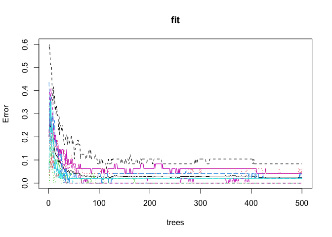
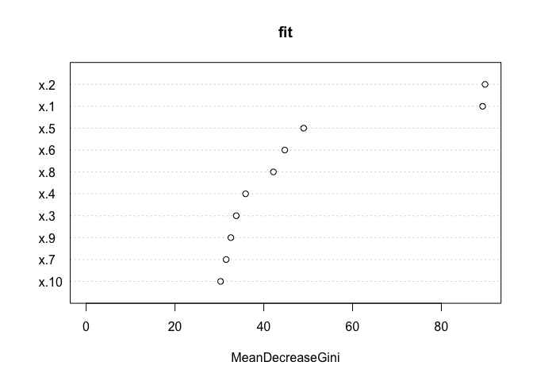

Homework 6
================
Donald Kane
March 28, 2022

``` r
#install.packages("randomForest")
library(randomForest)
library(caret)
```

``` r
train <- read.csv(url("https://web.stanford.edu/~hastie/ElemStatLearn/datasets/vowel.train"))
train <- train[,2:ncol(train)]
```

# Question 1

### Convert the response variable in the “vowel.train” data frame to a factor variable prior to training, so that “randomForest” does classification rather than regression.

``` r
train$y <- as.factor(train$y)
```

# Question 2

### Review the documentation for the “randomForest” function.

# Question 3

### Fit the random forest model to the vowel data using all of the 11 features using the default values of the tuning parameters.

``` r
fit <- randomForest(y ~ ., data=train)
print(fit)          ## summary of fit object
```

    ## 
    ## Call:
    ##  randomForest(formula = y ~ ., data = train) 
    ##                Type of random forest: classification
    ##                      Number of trees: 500
    ## No. of variables tried at each split: 3
    ## 
    ##         OOB estimate of  error rate: 2.46%
    ## Confusion matrix:
    ##     1  2  3  4  5  6  7  8  9 10 11 class.error
    ## 1  48  0  0  0  0  0  0  0  0  0  0  0.00000000
    ## 2   1 47  0  0  0  0  0  0  0  0  0  0.02083333
    ## 3   0  0 48  0  0  0  0  0  0  0  0  0.00000000
    ## 4   0  0  0 47  0  1  0  0  0  0  0  0.02083333
    ## 5   0  0  0  0 46  1  0  0  0  0  1  0.04166667
    ## 6   0  0  0  0  0 44  0  0  0  0  4  0.08333333
    ## 7   0  0  0  0  1  0 45  2  0  0  0  0.06250000
    ## 8   0  0  0  0  0  0  0 48  0  0  0  0.00000000
    ## 9   0  0  0  0  0  0  1  0 47  0  0  0.02083333
    ## 10  0  0  0  0  0  0  1  0  0 47  0  0.02083333
    ## 11  0  0  0  0  0  0  0  0  0  0 48  0.00000000

``` r
plot(fit)           ## plot OOB MSE as function of # of trees
```

<!-- -->

``` r
importance(fit)     ## variable importance 
```

    ##      MeanDecreaseGini
    ## x.1          89.29322
    ## x.2          89.84095
    ## x.3          33.79641
    ## x.4          35.90800
    ## x.5          48.97472
    ## x.6          44.72856
    ## x.7          31.51964
    ## x.8          42.16544
    ## x.9          32.59161
    ## x.10         30.27589

``` r
varImpPlot(fit)     ## variable importance plot
```

<!-- -->

# Question 4

### Use 5-fold CV and tune the model by performing a grid search for the following tuning parameters: 1) the number of variables randomly sampled as candidates at each split; consider values 3, 4, and 5, and 2) the minimum size of terminal nodes; consider a sequence (1, 5, 10, 20, 40, and 80).

``` r
candidates <- c(3,4,5)
nodes <- c(5,10,20,40,80)
control = trainControl(method = 'cv', 
                       number = 5, 
                       search = 'grid')
tunegrid = expand.grid(mtry = candidates, 
                       min.node.size = nodes, 
                       splitrule = 'gini')
fit = train(y~.,
                  data = train,
                  metric = 'Accuracy',
                  method = 'ranger',
                  tuneGrid=tunegrid,
                  trControl=control)
fit
```

    ## Random Forest 
    ## 
    ## 528 samples
    ##  10 predictor
    ##  11 classes: '1', '2', '3', '4', '5', '6', '7', '8', '9', '10', '11' 
    ## 
    ## No pre-processing
    ## Resampling: Cross-Validated (5 fold) 
    ## Summary of sample sizes: 420, 423, 423, 422, 424 
    ## Resampling results across tuning parameters:
    ## 
    ##   mtry  min.node.size  Accuracy   Kappa    
    ##   3      5             0.9602832  0.9563026
    ##   3     10             0.9376187  0.9313715
    ##   3     20             0.8978286  0.8876152
    ##   3     40             0.7765532  0.7542574
    ##   3     80             0.6569544  0.6227795
    ##   4      5             0.9584310  0.9542658
    ##   4     10             0.9394535  0.9333906
    ##   4     20             0.8978120  0.8876005
    ##   4     40             0.7746831  0.7522033
    ##   4     80             0.6473953  0.6122172
    ##   5      5             0.9432464  0.9375622
    ##   5     10             0.9320475  0.9252433
    ##   5     20             0.8825023  0.8707671
    ##   5     40             0.7650883  0.7416180
    ##   5     80             0.6339883  0.5974680
    ## 
    ## Tuning parameter 'splitrule' was held constant at a value of gini
    ## Accuracy was used to select the optimal model using the largest value.
    ## The final values used for the model were mtry = 3, splitrule = gini
    ##  and min.node.size = 5.

# Question 5

### With the tuned model, make predictions using the majority vote method, and compute the misclassification rate using the ‘vowel.test’ data.

``` r
test = read.csv(url("https://web.stanford.edu/~hastie/ElemStatLearn/datasets/vowel.test"))
set.seed(23188)
fit = randomForest(y~., 
                   data = train, 
                   mtry = 3, 
                   nodesize = 1)
test = test[,2:ncol(test)]
test$y = as.factor(test$y)
preds = predict(fit, newdata = test)
confusionMatrix(test$y,preds)
```

    ## Confusion Matrix and Statistics
    ## 
    ##           Reference
    ## Prediction  1  2  3  4  5  6  7  8  9 10 11
    ##         1  32  9  1  0  0  0  0  0  0  0  0
    ##         2   0 23 14  0  0  0  0  0  5  0  0
    ##         3   0  3 27  5  0  3  0  0  0  0  4
    ##         4   0  0  3 26  0 13  0  0  0  0  0
    ##         5   0  0  0  3 21 15  3  0  0  0  0
    ##         6   0  0  0  0 11 24  0  0  0  0  7
    ##         7   0  0  2  0  9  5 26  0  0  0  0
    ##         8   0  0  0  0  0  0  7 29  6  0  0
    ##         9   0  0  0  0  0  0  5  6 23  2  6
    ##         10  0 12  4  0  0  0  0  0  2 24  0
    ##         11  0  1  0  1  0  6  3  0 14  0 17
    ## 
    ## Overall Statistics
    ##                                          
    ##                Accuracy : 0.5887         
    ##                  95% CI : (0.5423, 0.634)
    ##     No Information Rate : 0.1429         
    ##     P-Value [Acc > NIR] : < 2.2e-16      
    ##                                          
    ##                   Kappa : 0.5476         
    ##                                          
    ##  Mcnemar's Test P-Value : NA             
    ## 
    ## Statistics by Class:
    ## 
    ##                      Class: 1 Class: 2 Class: 3 Class: 4 Class: 5 Class: 6
    ## Sensitivity           1.00000  0.47917  0.52941  0.74286  0.51220  0.36364
    ## Specificity           0.97674  0.95411  0.96350  0.96253  0.95012  0.95455
    ## Pos Pred Value        0.76190  0.54762  0.64286  0.61905  0.50000  0.57143
    ## Neg Pred Value        1.00000  0.94048  0.94286  0.97857  0.95238  0.90000
    ## Prevalence            0.06926  0.10390  0.11039  0.07576  0.08874  0.14286
    ## Detection Rate        0.06926  0.04978  0.05844  0.05628  0.04545  0.05195
    ## Detection Prevalence  0.09091  0.09091  0.09091  0.09091  0.09091  0.09091
    ## Balanced Accuracy     0.98837  0.71664  0.74646  0.85269  0.73116  0.65909
    ##                      Class: 7 Class: 8 Class: 9 Class: 10 Class: 11
    ## Sensitivity           0.59091  0.82857  0.46000   0.92308   0.50000
    ## Specificity           0.96172  0.96956  0.95388   0.95872   0.94159
    ## Pos Pred Value        0.61905  0.69048  0.54762   0.57143   0.40476
    ## Neg Pred Value        0.95714  0.98571  0.93571   0.99524   0.95952
    ## Prevalence            0.09524  0.07576  0.10823   0.05628   0.07359
    ## Detection Rate        0.05628  0.06277  0.04978   0.05195   0.03680
    ## Detection Prevalence  0.09091  0.09091  0.09091   0.09091   0.09091
    ## Balanced Accuracy     0.77632  0.89906  0.70694   0.94090   0.72079
