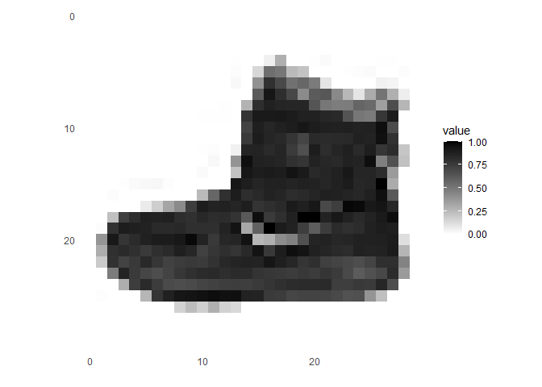
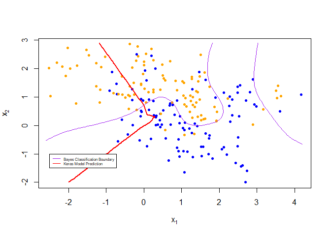
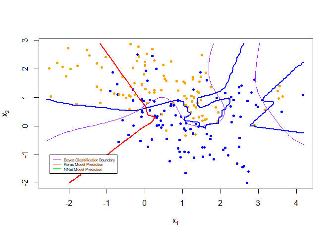

Homework &
================
Donald Kane
April 14, 2022

``` r
knitr::opts_chunk$set(echo = TRUE)
library(keras)
```

    ## Warning: package 'keras' was built under R version 4.1.3

``` r
library(tidyr)
library(ggplot2)
library(nnet)
library(dplyr)
```

    ## 
    ## Attaching package: 'dplyr'

    ## The following objects are masked from 'package:stats':
    ## 
    ##     filter, lag

    ## The following objects are masked from 'package:base':
    ## 
    ##     intersect, setdiff, setequal, union

``` r
library(nnet)
```

## Work through the “Image Classification” tutorial on the RStudio Keras website.

``` r
fashion_mnist <- dataset_fashion_mnist()
```

    ## Loaded Tensorflow version 2.8.0

``` r
c(train_images, train_labels) %<-% fashion_mnist$train
c(test_images, test_labels) %<-% fashion_mnist$test
dim(train_images)
```

    ## [1] 60000    28    28

``` r
dim(test_images)
```

    ## [1] 10000    28    28

``` r
class_names = c('T-shirt/top',
 'Trouser',
 'Pullover',
 'Dress',
 'Coat', 
 'Sandal',
 'Shirt',
 'Sneaker',
 'Bag',
 'Ankle boot')
image_1 <- as.data.frame(train_images[1, , ])
colnames(image_1) <- seq_len(ncol(image_1))
image_1$y <- seq_len(nrow(image_1))
image_1 <- gather(image_1, "x", "value", -y)
image_1$x <- as.integer(image_1$x)
ggplot(image_1, aes(x = x, y = y, fill = value)) +
 geom_tile() +
 scale_fill_gradient(low = "white", high = "black", na.value = NA) +
 scale_y_reverse() +
 theme_minimal() +
 theme(panel.grid = element_blank()) +
 theme(aspect.ratio = 1) +
 xlab("") +
 ylab("")
```

<!-- -->

``` r
#Numeric color values are needed from 0 to 1, not 0 to 255
train_images <- train_images / 255
test_images <- test_images / 255
#plot again to ensure that it worked
image_1 <- as.data.frame(train_images[1, , ])
colnames(image_1) <- seq_len(ncol(image_1))
image_1$y <- seq_len(nrow(image_1))
image_1 <- gather(image_1, "x", "value", -y)
image_1$x <- as.integer(image_1$x)
#Plots image 1
ggplot(image_1, aes(x = x, y = y, fill = value)) +
 geom_tile() +
 scale_fill_gradient(low = "white", high = "black", na.value = NA) +
 scale_y_reverse() +
 theme_minimal() +
 theme(panel.grid = element_blank()) +
 theme(aspect.ratio = 1) +
 xlab("") +
 ylab("")
```

<!-- -->

``` r
#Display first 25 images in dataset and checks to ensure that labels are applied properly
par(mfcol=c(5,5))
par(mar=c(0, 0, 1.5, 0), xaxs='i', yaxs='i')
for (i in 1:25) { 
 img <- train_images[i, , ]
 img <- t(apply(img, 2, rev)) 
 image(1:28, 1:28, img, col = gray((0:255)/255), xaxt = 'n', yaxt = 'n',
 main = paste(class_names[train_labels[i] + 1]))
}
```

<!-- -->

``` r
#setting up the layers of the model
model <- keras_model_sequential()
model %>%
 #transforms from 28x28 pixel 2d array to 784 pixel 1d array
 layer_flatten(input_shape = c(28, 28)) %>%
 #first layer has 128 nodes
 layer_dense(units = 128, activation = 'relu') %>%
 #second layer has 10 nodes, softmax indicates that these will show probabilities adding to 1 that the image belongs in one of the 10 digit classes
 layer_dense(units = 10, activation = 'softmax')
```

``` r
#compiles the model
model %>% compile(
 optimizer = 'adam', 
 loss = 'sparse_categorical_crossentropy',
 metrics = c('accuracy')
)
```

``` r
#Train the model
model %>% fit(train_images, train_labels, epochs = 5, verbose = 2)
```

``` r
score <- model %>% evaluate(test_images, test_labels, verbose = 0)
cat('Test loss:', score[1], "\n")
```

    ## Test loss: 0.3641261

``` r
cat('Test accuracy:', score[2], "\n")
```

    ## Test accuracy: 0.8673

``` r
#Make predictions on test set
predictions <- model %>% predict(test_images)
```

``` r
#Finally, plot predictions
par(mfcol=c(5,5))
par(mar=c(0, 0, 1.5, 0), xaxs='i', yaxs='i')
for (i in 1:25) { 
 img <- test_images[i, , ]
 img <- t(apply(img, 2, rev)) 
 # subtract 1 as labels go from 0 to 9
 predicted_label <- which.max(predictions[i, ]) - 1
 true_label <- test_labels[i]
 if (predicted_label == true_label) {
 color <- '#008800' 
 } else {
 color <- '#bb0000'
 }
 image(1:28, 1:28, img, col = gray((0:255)/255), xaxt = 'n', yaxt = 'n',
 main = paste0(class_names[predicted_label + 1], " (",
 class_names[true_label + 1], ")"),
 col.main = color)
}
```

<!-- -->

## Use the Keras library to re-implement the simple neural network discussed during lecture for the mixture data (see nnet.R). Use a single 10-node hidden layer; fully connected.

``` r
# load data
load(url('https://web.stanford.edu/~hastie/ElemStatLearn/datasets/ESL.mixture.rda'))
mix <- ESL.mixture
```

``` r
set.seed(546)
k_fit_model <- keras_model_sequential()
k_fit_model %>%
 layer_dense(units = 10, activation = 'relu') %>%
 layer_dense(units = 2, activation = 'softmax') 
k_fit_model %>% compile(
 optimizer = 'adam', 
 loss = 'sparse_categorical_crossentropy',
 metrics = c('accuracy')
)
```

``` r
set.seed(546)
k_fit_model %>% fit(x = mix$x, y = mix$y, epochs = 5, verbose = 2)
k_score <- k_fit_model %>% evaluate(mix$x, mix$y, verbose = 0)
cat('Test loss:', k_score[1], "\n")
```

    ## Test loss: 0.6494098

``` r
cat('Test accuracy:', k_score[2], "\n")
```

    ## Test accuracy: 0.575

``` r
plot_mixture_data <- expression({
 plot(mix$x[,1], mix$x[,2],
 col=ifelse(mix$y==0, 'blue', 'orange'),
 pch=20,
 xlab=expression(x[1]),
 ylab=expression(x[2]))
 ## draw Bayes (True) classification boundary
 prob <- matrix(mix$prob, length(mix$px1), length(mix$px2))
 cont <- contourLines(mix$px1, mix$px2, prob, levels=0.5)
 rslt <- sapply(cont, lines, col='purple')
})
eval(plot_mixture_data)
```

<!-- -->

``` r
set.seed(546)
k_probs <- k_fit_model %>% predict(mix$xnew)
k_preds <- function() {
 eval(plot_mixture_data)
 probs <- k_probs[,1]
 probm <- matrix(probs, length(mix$px1), length(mix$px2))
 cls <- contourLines(mix$px1, mix$px2, probm, levels=0.5)
 rslt <- sapply(cls, lines, col='red', lwd = 2)
 
 legend(-2.5,-1, legend=c("Bayes Classification Boundary", 
 "Keras Model Prediction"), 
 col=c("purple", "red"), lty=1:1, cex=0.5)
}
k_preds()
```

<!-- -->

## Create a figure to illustrate that the predictions are (or are not) similar using the ‘nnet’ function versus the Keras model.

``` r
set.seed(546)
nn_fit <- nnet(x=mix$x, y=mix$y, size=10, entropy=TRUE, decay=0)
```

    ## # weights:  41
    ## initial  value 134.957562 
    ## iter  10 value 98.594058
    ## iter  20 value 86.563750
    ## iter  30 value 78.876124
    ## iter  40 value 72.515374
    ## iter  50 value 65.408449
    ## iter  60 value 60.538626
    ## iter  70 value 58.009753
    ## iter  80 value 56.521572
    ## iter  90 value 56.063513
    ## iter 100 value 55.704070
    ## final  value 55.704070 
    ## stopped after 100 iterations

``` r
nn_probs <- predict(nn_fit, mix$xnew, type="raw")[,1]
nn_preds <- function() {
 eval(plot_mixture_data)
 
 probs <- nn_probs
 probm <- matrix(probs, length(mix$px1), length(mix$px2))
 cls <- contourLines(mix$px1, mix$px2, probm, levels=0.5)
 rslt <- sapply(cls, lines, col='blue', lwd = 2)
 
 probs1 <- k_probs
 probm1 <- matrix(probs1, length(mix$px1), length(mix$px2))
 cls1 <- contourLines(mix$px1, mix$px2, probm1, levels=0.5)
 rslt1 <- sapply(cls1, lines, col='red', lwd = 2)
 
 legend(-2.5,-1, legend=c("Bayes Classification Boundary", 
 "Keras Model Prediction", 
 "NNet Model Prediction"), 
 col=c("purple", "red","green"), lty=1:1, cex=0.5)
 
}
nn_preds()
```

<!-- -->
